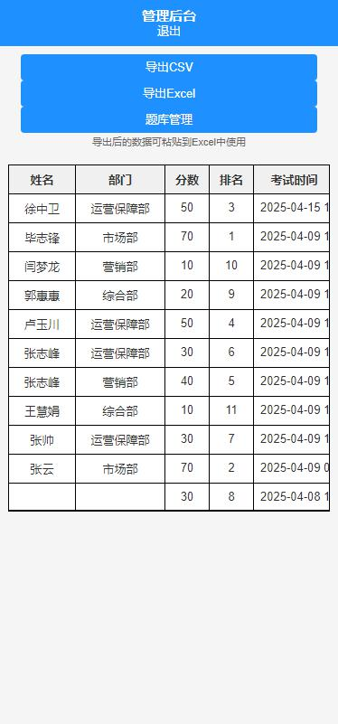

# 安全生产知识考试系统

一个基于 uni-app 开发的安全生产知识考试小程序，用于企业员工安全生产知识的在线考核。

## 功能特点

### 考生端功能
- 用户信息管理
  - 姓名和部门信息录入
  - 信息本地持久化存储
  - 支持信息修改更新
- 考试功能
  - 50题题库，随机抽取10题组卷
  - 考试时长15分钟，自动计时
  - 实时显示答题进度和剩余时间
  - 支持题目切换和修改答案
  - 自动判分和成绩统计
- 成绩查看
  - 考试完成后即时查看得分
  - 显示个人历史最好成绩
  - 显示当前排名情况
  - 查看考试正确答案
- 题库浏览
  - 支持查看完整题库
  - 显示题目答案解析
  - 便于考前复习

### 管理员功能
- 登录验证
  - 管理员账号密码验证
  - 登录状态维护
- 考试记录管理
  - 查看所有考生成绩
  - 支持按部门筛选
  - 显示考试时间和得分
- 数据导出
  - 支持导出CSV格式
  - 支持导出Excel格式
  - 包含考生信息和成绩数据
- 题库管理
  - 查看完整题库
  - 题目分类管理
  - 正确答案显示

## 技术栈

- 前端框架：uni-app
- 开发语言：TypeScript、UTS
- UI组件：uni-ui
- 状态管理：Vuex
- 数据存储：本地存储
- 开发工具：HBuilderX
- 小程序平台：微信小程序

## 安装和运行

1. 克隆项目
```bash
git clone https://github.com/164149043/examination.git
```

2. 安装依赖
```bash
npm install
# 或者使用 yarn
yarn install
```

3. 使用 HBuilderX 打开项目

4. 运行项目
- 在 HBuilderX 中选择"运行到小程序模拟器"
- 或选择"发行"，生成小程序代码

## 项目结构

```
├── pages                    # 页面文件
│   ├── index               # 首页（考试入口）
│   ├── examPaper           # 考试答题页面
│   ├── examResult         # 考试结果页面
│   ├── examList           # 考试列表页面
│   ├── examDetail         # 考试详情页面
│   ├── score              # 成绩查询页面
│   ├── profile            # 个人信息页面
│   ├── questionBank       # 题库浏览页面
│   └── admin              # 管理后台相关页面
│       ├── login          # 管理员登录
│       ├── dashboard      # 管理后台首页
│       └── questionBank   # 题库管理页面
├── static                  # 静态资源
│   └── images             # 图片资源
├── utils                   # 工具函数
│   └── questionBank.js    # 题库数据和相关方法
└── App.uvue               # 应用入口文件
```

## 使用说明

### 考生使用流程
1. 首次使用填写个人信息（姓名和部门）
2. 可以在首页选择：
   - 开始考试：进入答题页面
   - 查看题库：浏览所有题目
   - 查看成绩：查看历史考试记录
3. 考试过程：
   - 答题时显示剩余时间和进度
   - 可以修改已答题目
   - 时间到自动提交
4. 完成考试后显示：
   - 考试得分
   - 排名情况
   - 正确答案对照

### 管理员使用流程
1. 通过管理员入口登录
   - 默认账号：admin
   - 默认密码：123456
2. 管理功能：
   - 查看所有考试记录
   - 导出考试数据
   - 管理题库内容

## 注意事项

- 考试过程中请勿刷新或关闭页面
- 同一用户（姓名和部门相同）多次考试只保留最新成绩
- 建议使用最新版本的微信开发者工具进行调试
- 确保网络环境稳定，避免考试中断
- 定期导出考试数据，防止数据丢失

## 更新日志

### v1.0.0 (2025-04-16)
- 完成基础考试功能
- 实现管理员后台
- 支持成绩导出
- 题库管理功能

## 贡献指南

1. Fork 本仓库
2. 创建新的分支 `git checkout -b feature/your-feature`
3. 提交更改 `git commit -am 'Add some feature'`
4. 推送到分支 `git push origin feature/your-feature`
5. 创建 Pull Request

## 版权信息

Copyright © 2025 张一依有把越女剑

## 联系方式

- 作者：张一依有把越女剑
- 邮箱：164149043@qq.com
- GitHub：https://github.com/164149043

## 项目截图

### 考生端


### 管理员端

